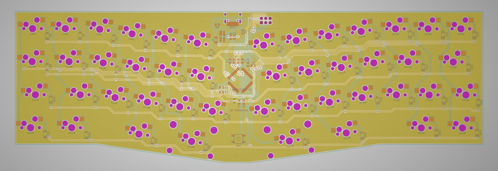

# Minister_E

Minister_e is a hot swap 40% with a centered USB port and the layout of the prime_e V2.
I made this because the designer of the prime_e had no intention of making a hot swap version of the V2 PCB and I wanted one.

The step file can be found in the [docs](./docs) folder.
